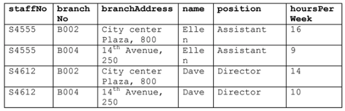

# Example 1

Consider the following relation to answer the questions that follows. 

a) The relation is NOT in 1NF. Why? 
 
b) Normalize the relation to 1NF. 

# Example 2

Consider the following relation to answer the questions that follows. 

**NOTES:** 
&nbsp;&nbsp;&nbsp;&nbsp; Key is {StaffNO, BranchNO}

**Functional Dependencies:** 
&nbsp;&nbsp;&nbsp;&nbsp; BranchNO -> Branchaddress
&nbsp;&nbsp;&nbsp;&nbsp; Branches(BranchNO*, Branchaddress)

&nbsp;&nbsp;&nbsp;&nbsp; StaffNO -> Staffname
&nbsp;&nbsp;&nbsp;&nbsp; Staffs(StaffNO*, Staffname)

&nbsp;&nbsp;&nbsp;&nbsp; {BranchNO, StaffNO} -> hoursPerWeek
&nbsp;&nbsp;&nbsp;&nbsp; Works(BranchNO*, StaffNO*, hoursPerWeek)

a) The relation is NOT in 2NF. Why? 
 
b) Normalize the relation to 2NF, showing the (partial) functional dependencies to the key. 

# Example 3
**NOTES** 
&nbsp;&nbsp;&nbsp;&nbsp; Key is {petID, VisitDate, procedureid}

**Functional Dependencies:**
petID -> petName, petType, petAge
Pets(petType, PetName, petAge)
VisitDate -> procedureid 
Procedures(P)

Consider the following relation to answer the questions that follows. 

a) Normalize the relation to 1NF. (First Normal form)

**Notice** There is a Column Violation on visitDate and procedure

visitDate - can be split into month and date 
procedure - can be split into id and description

b) Normalize the relation to 2NF. 

# Example 4

Consider the following invoice.

From the invoice, we can derive the following unnormalized (UNF) relation: 	

**NOTES:**

**Functional Dependencies:**

Invoices( date , petName*, description*, CustName*, amt)
Customers(custName*, custAddress)

Normalize the invoice relation to 3NF.  Assume, based on the previous exercise, that each pet can be uniquely identified by an ID and that each procedure also has an unique ID. Also, consider adding an ID to uniquely identify a customer, pet and procedure. 

Solution: 
'''
key is: {num, date, petName}
num -> date, custName, petName (2NF violation)
'''

 

